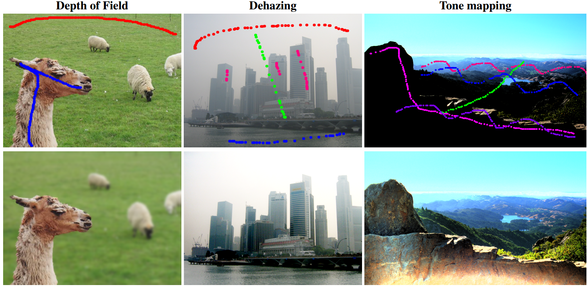

# Pixel-level Image Processing Apps


## General Information
A set of QT apps for pixel-level image processing, based on dense labeling from a very sparse user input.
- Journal: - Journal: Computer Graphics Forum (Presented at Pacific Graphics 2019)
- Writers:  Yun Liang, Yibo Gan, Mingqin Chen, Diego Gutierrez, Adolfo Muñoz
- Institute: College of Mathematics and Informatics, South China Agricultural University; Graphics and Imaging Lab, Universidad de Zaragoza

For information please see the paper:
 - Generic Interactive Pixel-level Image Editing
   [**Journal: Computer Graphics Forum 2019**](http://giga.cps.unizar.es/~amunoz/projects/CGF2019_editing/CGF2019_editing.pdfv),
 - Project Site [http://giga.cps.unizar.es/~amunoz/projects/CGF2019_editing/](http://giga.cps.unizar.es/~amunoz/projects/CGF2019_editing/)

Please cite our paper if you use any of the free material in this website:
- Bibtex:<br>
@inproceedings{liang2019generic,<br>
  title={Generic Interactive Pixel-level Image Editing},<br>
  author={Liang, Y and Gan, Y and Chen, M and Gutierrez, D and Mu{\~n}oz, A},<br>
  booktitle={Computer Graphics Forum},<br>
  volume={38},<br>
  number={7},<br>
  pages={23--34},<br>
  year={2019},<br>
  organization={Wiley Online Library}<br>
}
## Compiling the apps

The following must be installed into your computer:
* [git] (https://git-scm.com/) for downloading the source code.
* A C++11 capable compiler (gcc, clang...) for your operating system.
* [CMake](https://cmake.org/) for cross-compilation.
* [OpenCV](http://opencv.org/) for image processing.
* [OpenCV_contrib](https://github.com/opencv/opencv_contrib) for extra opencv modules.
* [Qt 5] (https://www.qt.io/) for the user interface.

You can clone the repository and compile everything (git + cmake + g++):
```
git https://github.com/scut-mingqinchen/generic_pixel-level_editing.git
cd generic_pixel-level_editing
mkdir build
cd build
cmake -G "Unix Makefiles" -DCMAKE_BUILD_TYPE=Release ..
make
```
Note that in OS X and Windows you will probably need to add the path to wherever QT5 is installed when running cmake, for example:
```
cmake -G "Unix Makefiles" -DCMAKE_BUILD_TYPE=Release -DCMAKE_PREFIX_PATH=/usr/local/Cellar/qt5/5.5.1_2/ ..
```
some typical places where you may have qt5 installed:
OS X (if installed with homebrew): /usr/local/Cellar/qt5/5.*.*/
OS X (if installed Qt's official package): ~/Qt5.*.*/5.*.*/clang_64/
Windows (if installed from Qt's official package with mingw): c:\Qt\5.*.*\mingw482_32\


This will compile all the aps and store the executable files in `generic_pixel-level_editing/bin`. In order to execute them please you can either set that folder as part of the `PATH` environment variable, or move to the folder and execute there. None of the three

Using the `build` is recommended in order to avoid poluting the folder with the code with all the compilation files.

Notice that `cmake` has many generators, it is supposed to help cross-plattform compilation. Some of them generate different kinds of makefiles, while some others generate specific IDE projects (such as Visual Studio or XCode projects). Find more information [here](https://cmake.org/cmake/help/v3.0/manual/cmake-generators.7.html).

The parameter `-DCMAKE_BUILD_TYPE=Release` is required for optimization purposes on command-line generators, and can be replaced by `-DCMAKE_BUILD_TYPE=Debug` for debug purposes. IDE generators will include both build types into the corresponding projects.


